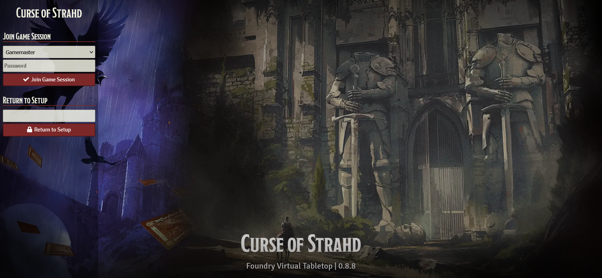

# Description

This is just some CSS to customize the Foundry login page.

# Use

Add the CSS to the end of the `/foundry_vtt/resources/app/public/css/style.css` file. This will need to be re-applied with each update.

**Note:** make a backup copy of the original `style.css`.

# Changelog

**1.0.0**

- Initial version for Foundry 0.8.8

**1.0.1**

- Remove title section background.
- Add warning to backup original styles.
